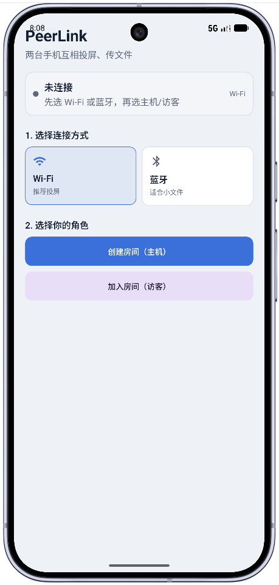
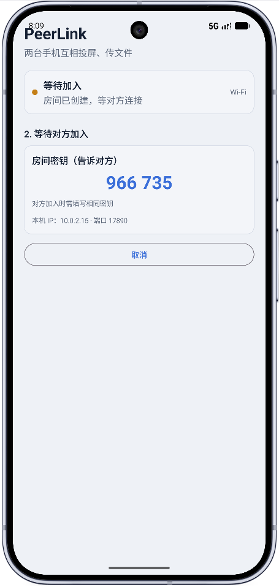
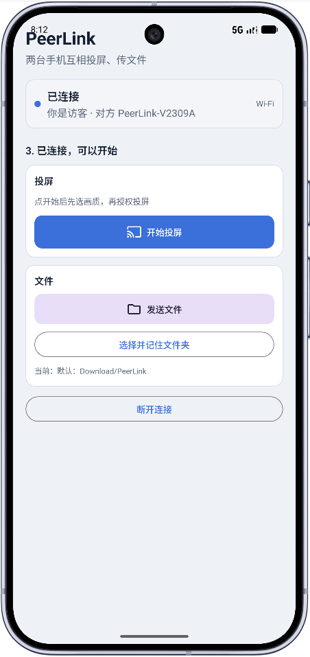
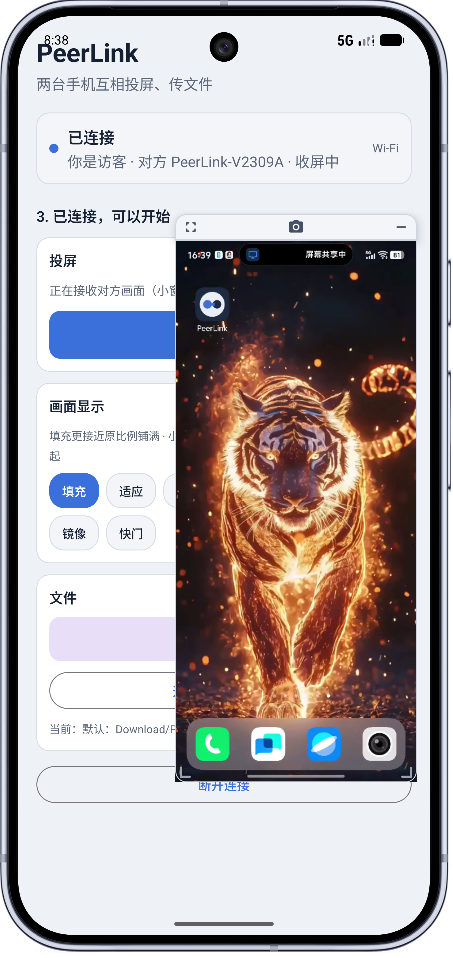
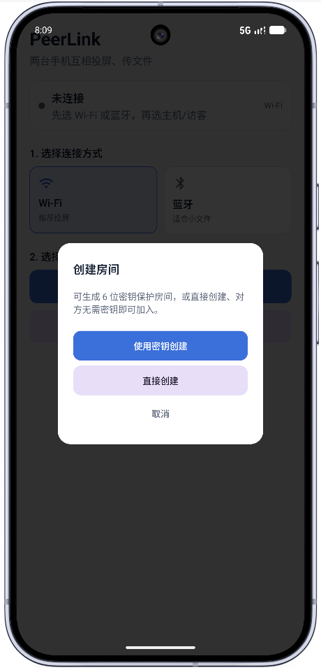
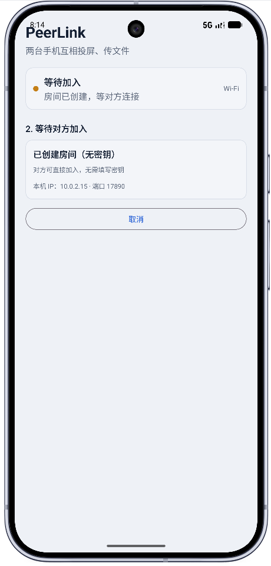
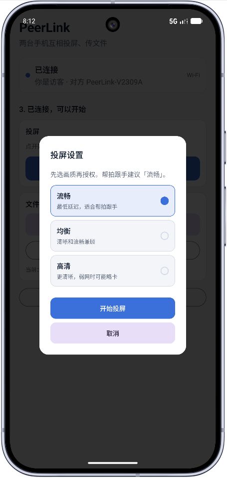
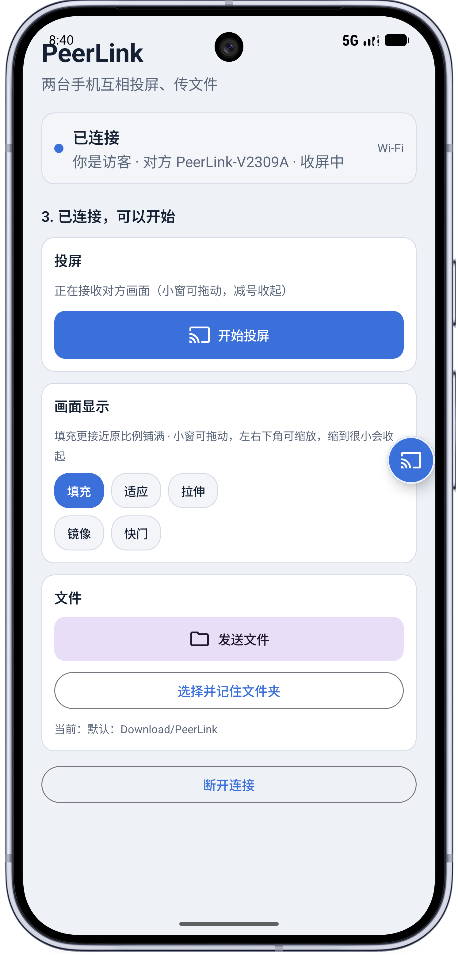
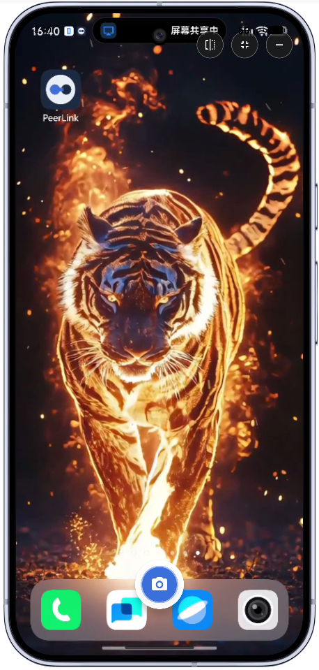

# PeerLink

**双机投屏 · 文件互传 · 远程帮拍**

同一 Wi‑Fi 或蓝牙下，两台 Android 手机互相分享屏幕、传输文件；接收端可用悬浮小窗观看，并可远程触发对方相机快门。

<p align="center">
  
  
  
  
</p>

---

## 功能一览

| 功能 | 说明 |
|------|------|
| 局域网投屏 | MediaProjection 采集 → H.264 编码 → 对端解码显示 |
| 蓝牙链路 | 已配对设备走 RFCOMM；适合传小文件，投屏可能卡顿 |
| 房间密钥 | 可选 6 位数字密钥，防止同网误连；也可无密钥直接加入 |
| 文件互传 | 任意文件分块传输，默认保存到 `Download/PeerLink` |
| 悬浮小窗 | 收屏 PiP 可拖动、缩放；缩到很小会收起成气泡 |
| 远程帮拍 | 无障碍服务代按系统相机快门（需用户手动开启） |
| 画质档位 | 流畅 / 均衡 / 高清，投屏前可选，帮拍跟手建议「流畅」 |

---

## 界面预览

以下均为真机截图。

### 1. 连接流程

| 首页 | 创建房间 | 密钥房间（主机） | 无密钥房间（主机） |
|:---:|:---:|:---:|:---:|
|  |  |  |  |

- **首页**：先选 Wi‑Fi（推荐投屏）或蓝牙（适合小文件），再选「创建房间（主机）」或「加入房间（访客）」
- **创建房间**：弹窗可选「使用密钥创建」或「直接创建」
- **密钥房间**：主机展示 6 位密钥（如 `966 735`）与本机 IP / 端口，对方加入时需填相同密钥
- **无密钥房间**：提示对方可直接加入，无需填写密钥

### 2. 已连接 · 投屏与文件

| 已连接会话 | 投屏设置 |
|:---:|:---:|
|  |  |

- **已连接**：状态卡显示角色与对方设备名；可「开始投屏」「发送文件」，并选择/记住接收文件夹（默认 `Download/PeerLink`）
- **投屏设置**：开始前选择画质——**流畅**（最低延迟，适合帮拍）、**均衡**、**高清**（更清晰，弱网可能略卡）

### 3. 收屏效果

| 悬浮小窗 | 收起为气泡 | 发送端屏幕共享中 |
|:---:|:---:|:---:|
|  |  |  |

- **悬浮小窗**：访客「收屏中」时以可拖动小窗显示对方画面；支持填充 / 适应，以及镜像、快门
- **最小化气泡**：小窗缩到很小后收起为边缘气泡，可再次展开
- **发送端**：系统状态显示「屏幕共享中」，可一边投屏一边继续使用本机

---

## 快速开始

### 环境

| 项 | 要求 |
|----|------|
| Android Studio | 建议最新稳定版 |
| JDK | 17 |
| 最低系统 | Android 8.0（API 26） |
| compileSdk / targetSdk | 35 |

### 打开与运行

1. Android Studio → **Open** → 选择本仓库根目录  
2. 等待 Gradle Sync  
3. USB 调试连接两台真机，分别 Run 安装  

```bash
# Windows
gradlew.bat assembleDebug

# macOS / Linux（需可执行的 gradlew）
./gradlew assembleDebug
```

产物：`app/build/outputs/apk/debug/app-debug.apk`

> **路径提示**：若项目目录含中文等非 ASCII 字符，Windows 上 AGP 可能报错。已在 `gradle.properties` 中设置 `android.overridePathCheck=true`；更稳妥是把工程放到纯英文路径（如 `D:\Work\PeerLink`）。

---

## 使用说明

### 局域网（推荐）

1. 两台手机连同一 Wi‑Fi（避免访客网络隔离）
2. A：**创建房间（主机）** → 选「使用密钥创建」或「直接创建」
3. B：**加入房间（访客）** → 点选附近设备，或输入主机页显示的 IP
4. 连接成功后：一方点「开始投屏」并选画质、授权录屏；任意一方可「发送文件」

### 蓝牙

1. 系统设置中先完成蓝牙配对  
2. 双方切换到「蓝牙」模式  
3. 一方主机、一方在已配对列表中点选对方  
4. 带宽有限，优先用于小文件；投屏可能卡顿  

### 帮拍

1. 系统设置 → 无障碍 → 开启 PeerLink  
2. 接收端在收屏界面点「快门」  
3. 发送端若正开着系统相机，将代按快门（不会替相机存文件）  

---

## 权限说明

| 权限 | 用途 |
|------|------|
| 通知 | 投屏 / 连接保活前台服务 |
| 蓝牙 | 蓝牙发现与 RFCOMM 传输 |
| 存储 / 媒体 | 选择发送文件、写入接收目录 |
| 位置（旧系统） | 蓝牙扫描兼容 |
| 录屏授权 | 系统 MediaProjection 弹窗（投屏时） |
| 无障碍 | 可选，仅用于远程帮拍 |

---

## 技术架构

| 模块 | 实现 |
|------|------|
| 发现 | NSD `_peerlink._tcp.` |
| 传输 | 自定义 `PLNK` 分帧协议（TCP / 蓝牙 RFCOMM） |
| 投屏 | MediaProjection → MediaCodec H.264 → 对端解码 |
| 文件 | 分块传输 + MediaStore / 用户选定目录 |
| UI | Jetpack Compose + Material 3 |
| 包名 | `com.peerlink.app` |

```
app/src/main/java/com/peerlink/app/
├── MainActivity.kt / PeerLinkApp.kt
├── bluetooth/     # 蓝牙 RFCOMM
├── cast/          # 采集、编解码、画质、帮拍
├── network/       # TCP 会话、NSD 发现
├── protocol/      # PLNK 编解码
├── service/       # 投屏前台、保活、无障碍
├── transfer/      # 文件传输
└── ui/            # Compose 界面、悬浮窗、ViewModel
```

---

## 仓库结构

```
├── app/                 # Android 应用模块
├── docs/screenshots/    # README 真机截图
├── gradle/wrapper/      # Gradle Wrapper
├── README.md
├── LICENSE
├── .gitignore
└── gradle.properties
```

截图对照说明见 [`docs/screenshots/README.md`](docs/screenshots/README.md)。

---

## 许可证

本项目采用 [PolyForm Noncommercial License 1.0.0](LICENSE)。

- **允许**：个人学习、研究、爱好项目等非商业用途  
- **不允许**：商业使用（含售卖、打包进商业产品等）  

如需商业授权，请联系版权方另行协商。
